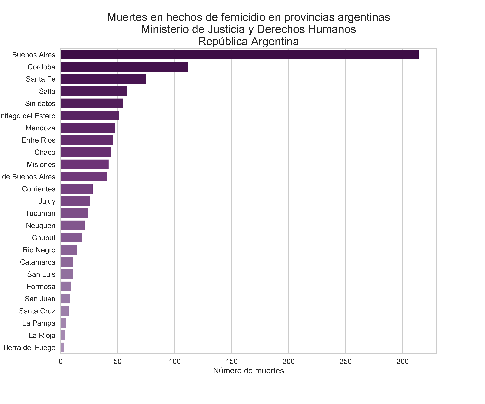
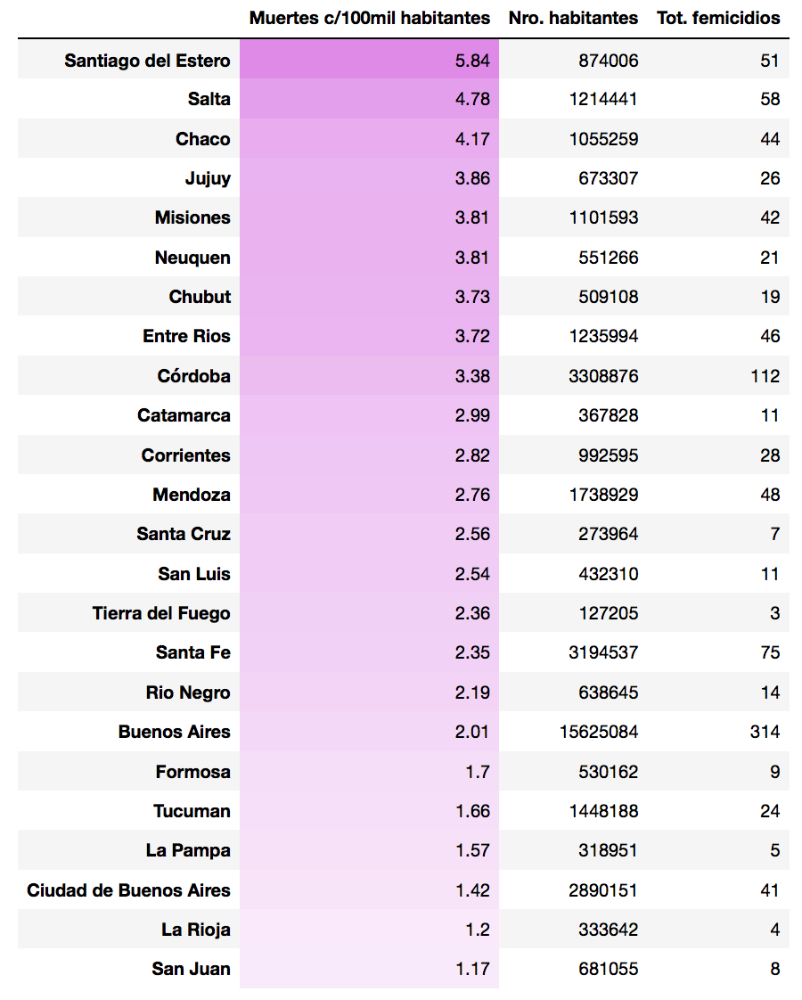
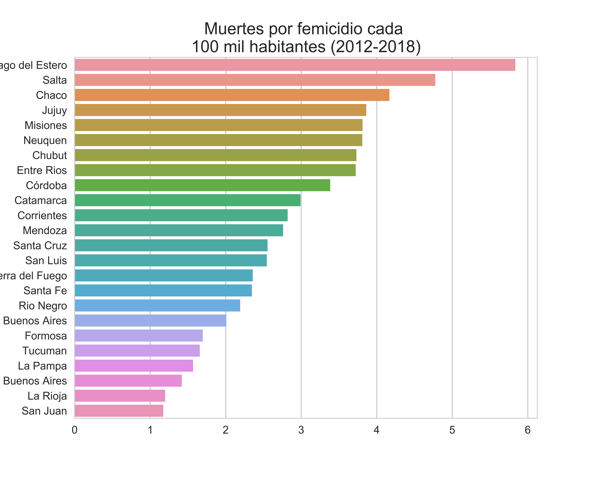
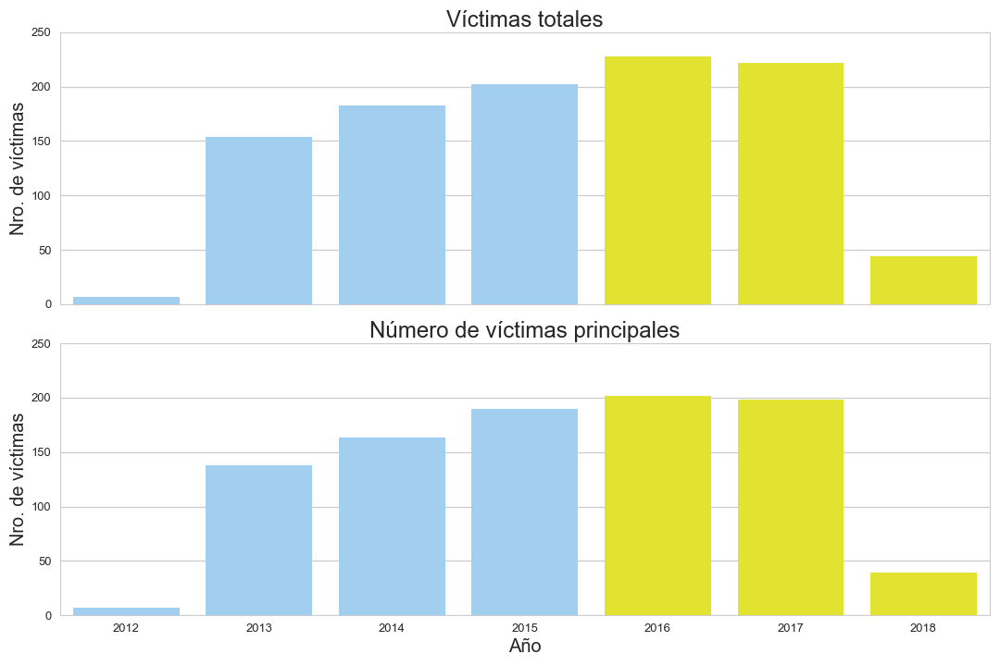
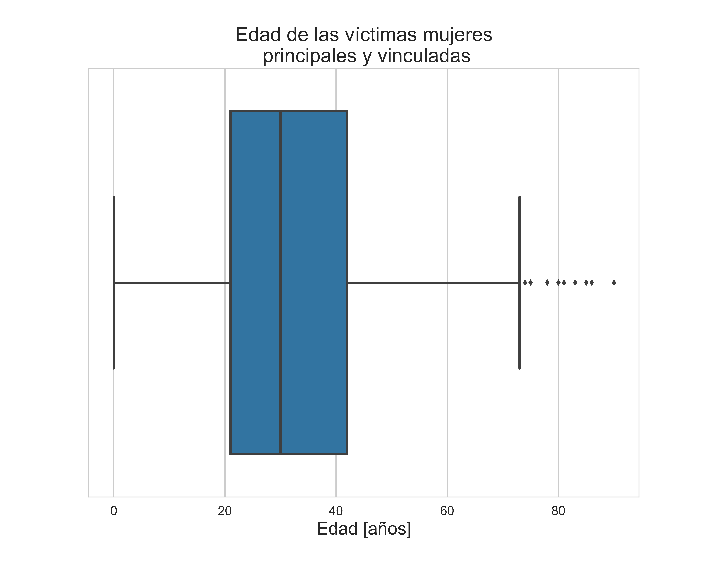
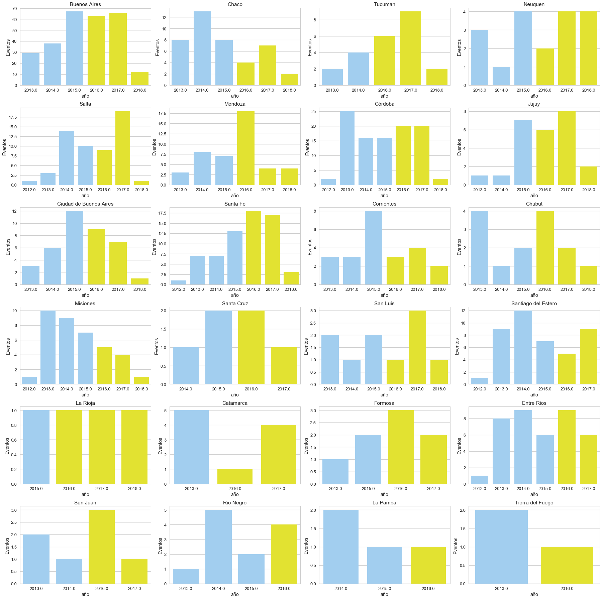
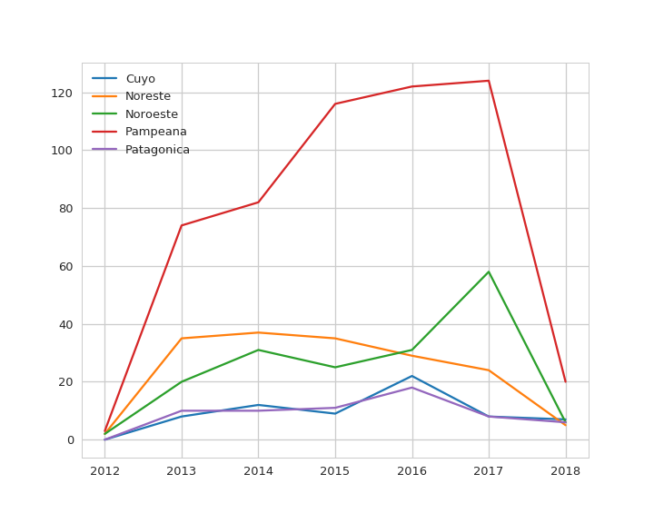
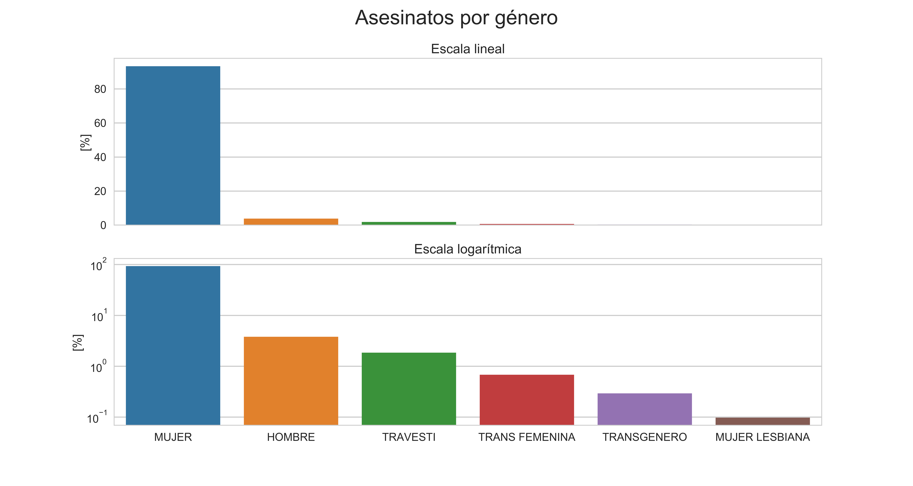
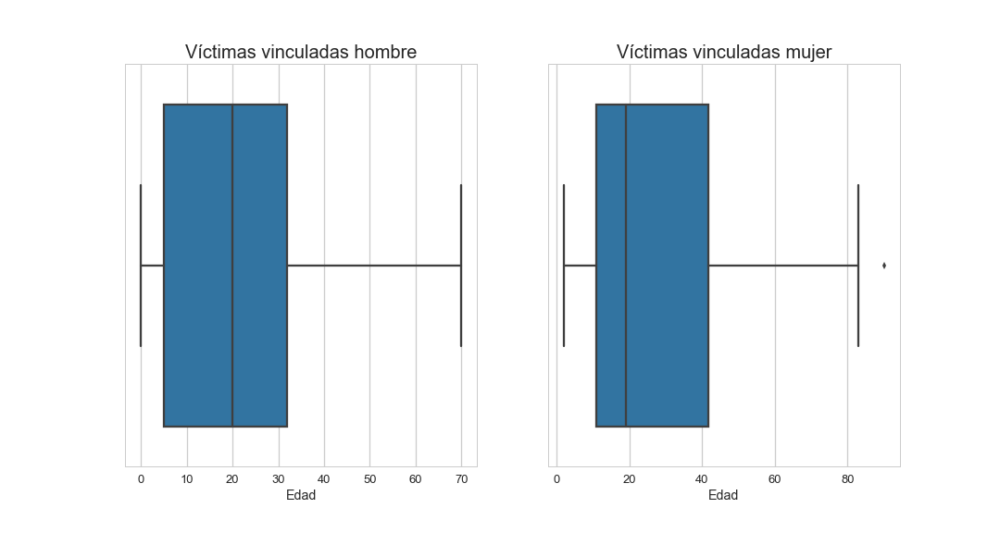

# Femicidio: expresión más radical del heteropatriarcado

*Por* Mauricio Clerici y Pedro Pérez

## El femicidio en las provincias argentinas

Como declaran *Bard Wigdor* y *Artazo* [1], el femicidio constituye "*la expresión más radical del masculinismo heterosexual dominante*", o lo que a grandes rasgos puede identificarse como el sistema de relaciones interpersonales y poder denominado comúnmente *heteropatriarcado*. Los autores de este artículo, hombres blancos heterosexuales (o simplemente *cisgénero*), vemos con preocupación la situación de violencia machista actual e intentamos aportar, desde un análisis estadístico sobre las [cifras oficiales]('http://datos.jus.gob.ar/dataset/27bb9b2c-521b-406c-bdf9-98110ef73f34/resource/a2e1c899-cbaa-4bf6-b623-6648f150cab0/download/registro-de-femicidios-2018-04-13.csv'), a la búsqueda de las causas que lo originan y las deficiencias sistémicas que lo permiten.

En su artículo, *Bard Wigdor* y *Artazo* señalan a Córdoba como la segunda provincia con mayor cantidad de femicidios, detrás de la provincia de Buenos Aires. Lo cual es correcto desde el punto de vista estrictamente numérico ante la pregunta: ¿cuántas mujeres mueren por año en cada provincia argentina?

La gráfica ordenada de la cantidad de femicidios por provincia en la república argentina, desde 2012, muestra claramente lo que las investigadoras marcan con preocupación.

Entendemos que esta afirmación debe ser seguida de una estimación que considere la cantidad de habitantes de cada provincia, ya que con ella contaremos con una cantidad más confiable para "medir" el impacto de la violencia machista sobre la vida de las mujeres. El [Censo 2010](https://www.sig.indec.gov.ar/censo2010/) provee los datos más actualizados respecto de la distribución poblacional de la República Argentina, por lo que es conveniente utilizarlo para estimar la *tasa* de muertes en hechos de femicidio en cada provincia.

Así, se puede evaluar cuántas muertes por femicidio se han producido en la Argentina, desde 2012, cada 100.000 habitantes. La siguiente Tabla muestra claramente esto, donde se pueden comparar las provincias también por su población y número total de femicidios.

Mientras que, para maximizar la interpretación de la tabla, es conveniente presentar estos resultados en gráfico de barras.

Se puede observar el cambio en la relación entre las provincias al analizar la tasa de mortalidad, cantidad más relevante para el estudio de estos fenómenos.

A pesar de que desde 2012 han muerto mucho más personas en las provincias de Buenos Aires, Córdoba y Santa Fé, se puede observar que es más peligroso para una mujer vivir en Santiago del Estero o Salta, donde mueren entre 5 y 6 mujeres cada 100 mil habitantes.

La tendencia natural para continuar el estudio es observar el PBI per cápita de cada provincia, lo cual muestra que, de las 4 provincias con mayor tasa de femicidios, 3 pertenecen a las más pobres. La excepción es Salta. Pero "*correlación no implica causalidad*" y esto obliga a investigar en otros factores socio-culturales, como el caso de la religiosidad. Aspecto que escapa a este artículo.

## Evolución de los femicidios desde 2012

Una visión más integral de la cuestión del femicidio, necesita de un análisis de la evolución temporal de éstos, por más que el registro con el que se cuenta parte de 2012.

De todas formas, es en esta época donde comienza el movimiento "#NiUnaMenos" y el Estado comienza a hablar del tema. Por lo que un análisis con datos previos implicaría considerar otras variables.

### Victimas principales y vinculadas

Al momento, los datos analizados incluyen el total de víctimas en situaciones de femicidios, tanto las principales como vinculadas. Entendiendo por vinculadas, aquellas victimas que al momento del crimen fueron asesinadas por tener alguna relación familiar y/o afectiva con la víctima principal.

Es importante observar la cantidad de femicidios desde 2012, no solo contemplando el cambio de gobierno de 2015 sino también la cantidad de víctimas totales y principales.

Se puede observar así, el crecimiento en la cantidad de femicidios por año. El gráfico de arriba muestra el total de víctimas y el de abajo de solamente las víctimas principales.

También se observa el crecimiento ante el cambio de gobierno, ya que en el gráfico se ha diferenciado con distinto color de barra a los años pertenecientes al gobierno de Cristina Fernandez de Kirchner (celeste) y al de Mauricio Macri (amarillo).

Las noticias periodísticas suelen mostrar casos de víctimas jóvenes, por lo general entre 20 y 35 años, por lo que es necesario verificar esto haciendo un análisis de la edad de las víctimas. Para esto, descartamos las víctimas hombes (todas vinculadas) y podemos ver que las mujeres asesinadas por femicidio coinciden con lo que se suele mostrar, encontrándose por lo general entre los 20 y los 40 años.

Aquí podemos ver que el 50% de las víctimas se ubican en un rango entre los 21 y 42 años, con una mediana de 30	años. También sabemos por los datos que la media es de 32 años y que la moda de 22; y por último que las víctimas de mas de 73 años son datos anomalos o *outliers*. Esto nos da la idea de que la mayoria de las víctimas son mujeres jóvenes mayores de edad. Algo preocupante de estos datos oficiales, es que no brindan ninguna información acerca del femicida o su relación con la víctima.

### Evolución temporal en las provincias

A la hora de evaluar las políticas de prevención aplicadas, los presupuestos ejecutados y demás, es necesario analizar la evolución de las muertes por femicidio provincia a provincia, a lo largo del tiempo.

Las tendencias cambian de provincia en provincia, pero como algunas de la mismas tienen poca población la cantidad de casos registrados también es muy bajo y eso quita capacidad de analizarlas, es por esto que el enfoque debe hacerse por regiones.

Este gráfico da una señal de alarma. Las regiones de Cuyo, Patagonia y Noreste han disminuido la cantidad de femicidios de 2016 a 2017, pero las regiones Pampeana y Noroeste han aumentado. Además, para lo que va de 2018, las 3 que habían disminuido en 2017 ya sobrepasaron el 50% de 2017 sin haber pasado un 30% del año 2018.

La situación más alarmante, en cambio, la tiene la región noreste donde la cantidad de femicidios prácticamente se duplicó de 2016 a 2017. El comportamiento parece no ser homogeneo en el país y son necesarios esfuerzos muy grandes desde la sociedad y el estado para atacar la problemática en las provincias del noreste argentino.

## "La maté porque es mía"

Para analizar el comportamiento de los femicidas e intentar dilucidar las causas que mueven este tipo de actos, es importante observar también la edad de las víctimas vinculadas y los asesinatos por género.

### Ella, ellos, elles

El estudio de los casos muestra que la gran mayoría de las victimas son mujeres, al punto que es necesario graficar en escala logarítmica para ver la contribución del resto de los géneros.

### Tus niños/as, mis niños/as

Pero para ver a quiénes se ataca cuando se quiere lastimar a la mujer, los femicidas actuan sobre determinados grupos etarios también.

Las estadísticas muestran que la moda en la edad de los varones muertos en femicidios es de 3, 4 y 7 años, mientras que la media y la mediana ascienden a 22 y 20 años respecticamente.

Se observa además, que en las víctimas vinculadas mujeres, la moda es 11 y 19 años, mientas que la media y la mediana son de 28 y 19 años respectivamente.

Esto demuestra que no solo las mujeres son propiedad del hombre heteropatriarcal, según su concepción. Sin información exacta sobre el vínculo de las víctimas vinculadas con la principal, se puede inferir que se trata de niños y niñas, que seguramente son hijos e hijas de las mujeres asesinadas.

Este último aspecto, fortalece la afirmación de *Bard Wigdor* y *Artazo* al entender al femicidio como herencia colonial capitalista y patriarcal. La instrumentación capitalista del cuerpo y paisaje de la mujer por parte del hombre "*se legitima mediante la construcción de un mundo simbólico inter-subjetivo con pretensiones de totalidad, que racionaliza narrativas y prácticas irracionales, como el femicidio, sustentado en la supuesta inferioridad de determinados sujetos frente a otros/as*". Estos sujetos, nos permitimos afirmar, en la mayoría de los casos, son hijos e hijas.

Lamentablemente, los datos no dan cuenta del nivel socio-culutural-económico de las víctimas, pero se puede inferir por las estadísticas en la región noroeste del país, que es en las zonas con mayores índices de religiosidad y conservadurismo social donde se vuelve más peligroso vivir para las mujeres.

[1] *"La maté porque es mía": femicidios en la provincia de Córdoba*. **G. Bard Wigdor & G.C. Artazo**, [Revista Latinoamericana de Estudios de Seguridad, No. 17, Quito, diciembre 2015, pp. 67-79](http://repositorio.flacsoandes.edu.ec/bitstream/10469/7962/1/RFLACSO-Ur17-05-Bard.pdf).
