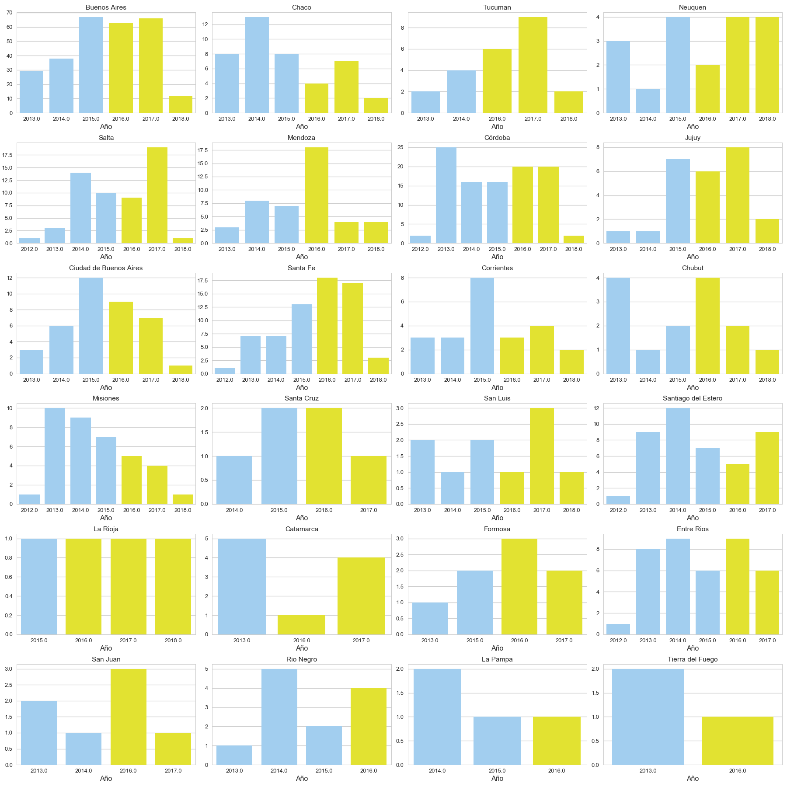

# Informe Laboratorio 1

**Autores**:

* Mauricio Clerici
* Pedro Pérez

## Elección del dataset

Hemos elegido el dataset de [femicidios](http://datos.jus.gob.ar/dataset/27bb9b2c-521b-406c-bdf9-98110ef73f34/resource/a2e1c899-cbaa-4bf6-b623-6648f150cab0/download/registro-de-femicidios-2018-04-13.csv') principalmente por una preocupación respecto del tema.

Este informe cuenta con *pros*:

* está actualizado a 2018
* discrimina por provincias
* discrimina entre víctimas principales y vinculadas

Y cuenta con algunos *cons*:

* la cantidad de datos no puede necesariamente considerarse *grande* para análisis estadístico, aunque resulta *aceptable*
* la discriminación por género permite dudar, al contar con solo un caso de asesinato de *mujer lesbiana*. Esto depende fuertemente de la formación y las posiciones políticas o religiosas de quienes cargan los datos.
* no se cuentan con datos del femicida, ni del tipo de vínculo con la víctima, lo cual enriquecería el análisis.
* no se poseen datos del tipo de vínculo entre la víctima principal y las vinculadas.

## Respuestas a las consignas

### Consigna 1:

*Realizar un análisis descriptivo a partir del dato año en el que se produjo el hecho, diferenciando los distintos gobiernos. Luego realizar por provincia ese mismo análisis. Hay alguna provincia que los gráficos sean visiblemente distintos a la tendencia nacional?*

En `In[17]` se puede encontrar la primera parte de esta respuesta, que provee la figura 1:

Mientras que la segunda parte se encuentra en `In[20]` y provee la figura 2:

En este caso, la única provincia que marca una tendencia 'clara' es la de Misiones (a la vez es distinta a la tendencia nacional), con un descenso año a año de la cantidad de femicidios. Habría que esperar termine 2018 para completar el análisis, ya que por los poco computado de este año, parece que esa tendencia se puede revertir. Algo similar puede suceder en la Ciudad de Buenos Aires, mientras que a la inversa (claramente crece) sucede con los femicidios en las provincias de Santa Fe y Tucumán.

En el resto de las provincias, la poca cantidad de datos y de años para analizar, no permiten un análisis serio al respecto.

### Consigna 2:

*Con las edades de las víctimas realizar un análisis de las medidas de localización central. Realizar un análisis de outliers. Brindar un breve análisis del resultado obtenido.*

Estos resultados se encuentran en el Notebook en los `Output` de los `In[6]` al `In[12]`.

Algunos de los resultados se muestran en Figuras 3 y 4:

### Consigna 3:

*Calcular la correlación entre cantidad de víctimas en  regiones de nuestro país (noreste, noroeste, centro, cuyo y patagonia) y mostrarla con un gráfico conjunto.*

Este resultado se muestra al final del notebook y puede observarse en la Figura 5.

